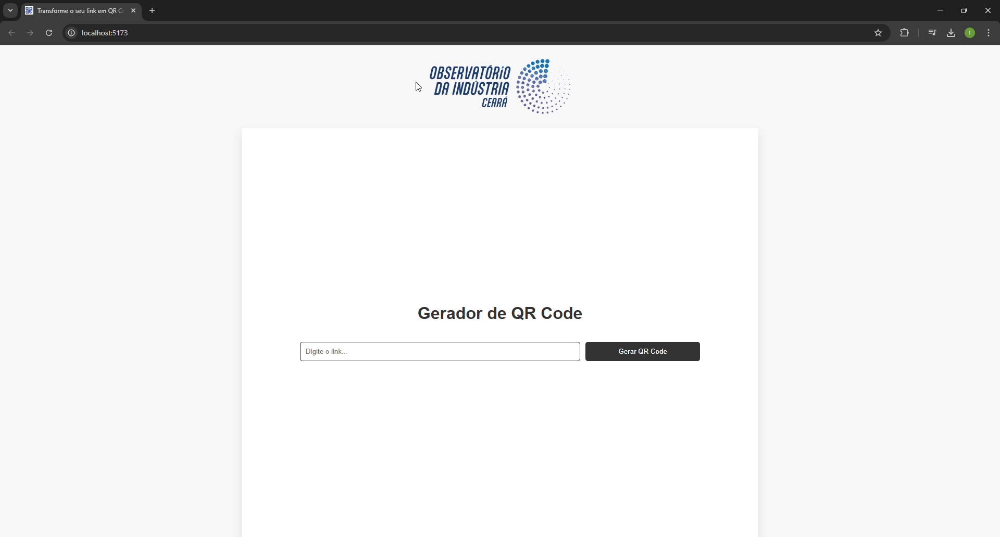

# QR Code Generator

## 📌 Visão Geral
Este projeto é um gerador de QR Codes responsivo e eficiente, desenvolvido utilizando **Vite** para otimização de desempenho. Permite a entrada de um link e gera um QR Code correspondente, oferecendo a opção de download no formato **JPG**.

## 🚀 Tecnologias Utilizadas
- **React + Vite** → Rápido e moderno
- **qrcode.react** → Geração de QR Codes diretamente no frontend
- **html2canvas** → Conversão do QR Code em imagem JPG
- **Bootstrap Icons** → Melhor experiência visual com ícones leves

## 📂 Estrutura do Projeto
```
/link-to-qrCode
│── .gitignore
│── eslint.config.js
│── index.html
│── package.json
│── README.md
│── vite.config.js
│── /public
│    └── icons8-qr-code.gif
│── /src
│    ├── App.css
│    ├── App.jsx
│    ├── index.css
│    ├── main.jsx
│    ├── /assets
│    │   ├── react.svg
│    │   └── /images
│    │       └── logo-branca.png
│    └── /components
│        ├── QRCodeDownload.jsx
│        ├── QRCodeForm.jsx
│        └── QRCodeGenerator.jsx
```

## 🛠️ Como Executar o Projeto
### 1️⃣ Clone o repositório
```sh
git clone https://github.com/seu-usuario/qrcode-generator.git
cd qrcode-generator
```

### 2️⃣ Instale as dependências
```sh
npm install
```

### 3️⃣ Inicie o projeto
```sh
npm run dev
```
Isso abrirá o projeto em `http://localhost:5173`.

## 🎯 Funcionalidades
✅ Geração de QR Code a partir de um link inserido pelo usuário  
✅ Download do QR Code no formato **JPG**  
✅ Interface responsiva e intuitiva  
✅ Rápida execução devido ao Vite  

## 📸 Demonstração


## 📌 Possíveis Melhorias Futuras
- Opção de download em outros formatos (PNG, SVG)
- Customização de cores do QR Code
- Salvamento de histórico de QR Codes gerados

## 🤝 Contribuição
Sinta-se à vontade para contribuir! Abra uma **issue** ou envie um **pull request** para melhorias.
